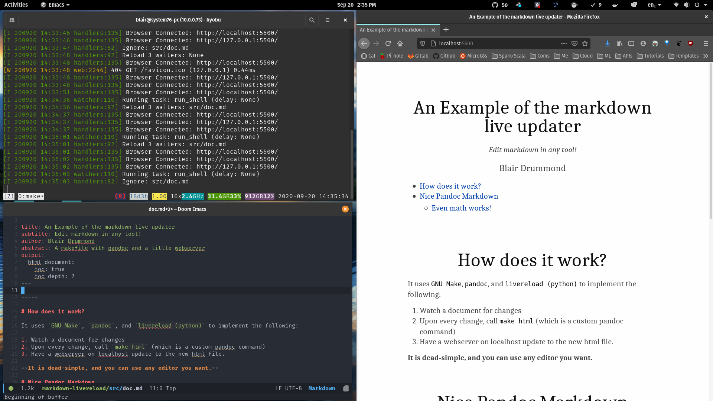

# Markdown editing with live preview

It works by running `make html` in a loop, while the pip package `livereload` watches your `doc.md` file.

The preview is served on [localhost](http://localhost:5500) and is automatically updated whenever you save `doc.md`. 

## Why?

The slick thing about this approach is that you can make your html output as fancy as you'd like, by controlling the `pandoc` command. In this example, I create a single `--self-contained` html file with customized css. You can't do this by default with other methods.

Also, this way, you can use whatever editor you like.
